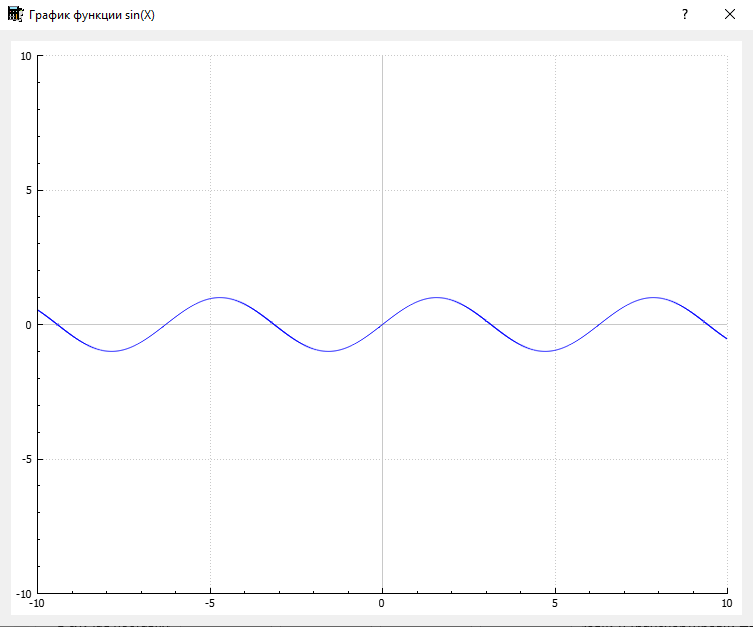

# mycalc

Созданный в рамках обучающего проекта "Школа 21" калькулятор на языке С++ с использованием фреймворка Qt.

## Основной функционал

[Матеатический калькулятор](#part-1)

[Кредитный калькулятор](#part-2)

[Депозитный калькулятор](#part-3)

## Математический калькулятор 
Реализованы следующие стандартные фукции:
 - математические функции
   - сложение 
   - вычитание
   - умножение
   - деление
   - деление по модулю
   - возведение в степень
   - вычисление квадратного корня
 - тригонометрические функций (
   - синус
   - косинус
   - тангенс
   - арксинус
   - арккосинус
   - арктангенс
   - натуральный логарифм
   - логарифм по основанию 10

### 1.1 Графики функций
Данный калькулятор может построить график записанного выражения при наличии переменной Х. 
Указать необходимый диапазон можно в окне настроек графика

После ввода выражения которе содержит переменную Х и нажатия на копку "=" откроется окно в котором начнется построение графика.

Скорость построения напрямую зависит от величины шага изменения переменной и вычислительной мощьности ПК.

## Кредитный калькулятор 

Данная опция позволяет расчитать размер ежемесечного платежа по кредиту.
Расчеты являются ориентировочными и могут отличаться от условий договора предлагаемых разными банками.

Для расчета необходимо указать
 - Размер кредита
 - Срок кредита
 - Процентную ставку по кредиту
 
 и выбрать указать интересующий тип платежей (ануитетный или дифференцированный)

При вычислени размера дифференцированного платежа отображается первый и последний платеж
## Депозитный калькулятор 

Данная опция позволяет расчитать
- размер начисленных процентов
- размер налогового вычета
- сумма счета депозита на конец периода

Также присутствует возможность учета дополнительных внесений и снятий со счета в течении срока вклада

И учет капитализации с интервалами: 
- каждый день
- каждую неделю
- каждый месяц
- каждый квартал
- каждый год
- в конце периода

Расчеты являются ориентировочными и могут отличаться от условий договора предлагаемых разными банками.

